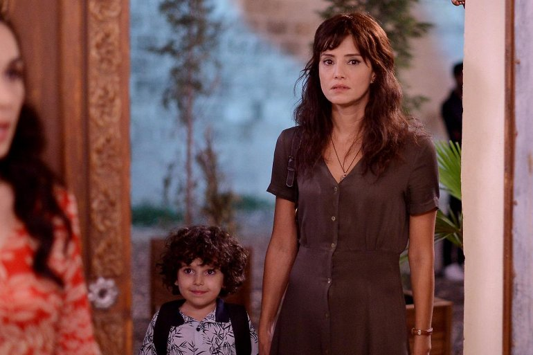

# Why are Turkish movies and soap operas so popular?

The popularity of Turkish TV series in Latin America and Spain is due to the nature of the plot, atmosphere and quality of Turkish film production. As for Russia and Eastern European countries, there are some reasons for it.

Since Turkey is a multicultural country, there are actors for every taste. The audience loves the actors' performance. These series very well reflect the social changes in society, the processes of migration from village to city, the problems of domestic violence, early marriages, the division between rich and poor, problems related to urbanization and family values. They represent a synthesis between East and West. The world sees it as a geographical and cultural bridge. In addition, there are similar social values. 

Turkish TV series industry conquers the world by region and stage. Now it is time for Latin America. It all started in 2008 with Eastern Europe and Middle East. There was a time when everyone watched soap operas from Latin America, but then Turkey confidently took its niche in the market. Their serials gained popularity in Russia and other countries of the region, then in Latin America, and now it is the turn of Spain and Italy. Even in the USA, there are good results.

## Public preferences

Each region has its own preferences, so in Latin America viewers choose drama series that raise ethnic issues such as "One Thousand and One Nights", "Return", "Mother" or "What is Fatmagul's Wine"? An excellent example of the heat of passion is the TV series "My Name is Melek", which deals with the fate of a girl who ran away from her own wedding for another man.

To save her son's life, the mother agrees to spend the night with her boss; the love of a modern city girl for the owner of a traditional farm; cruelty towards children and the history of complex relations between a girl and a young man - these stories have won the audience in Latin America because they reflect the urgent social and human problems.

In the Middle East, movies about modern life in Istanbul, a passionate love that overcomes the obstacles of poverty and wealth, are preferable. Eastern Europe, on the other hand, prefers naive love stories, the so-called soap operas. TV series production in Spain itself has slowed down due to the proliferation of digital Internet platforms and lack of funding.

The channels are more focused on reality shows. Producing a series is quite expensive, and TV channels cannot cover their expenses with advertising revenue. At the same time, the viewer has switched to digital platforms. As in Turkey, in Spain housewives watch the series doing their homework, and if they miss something, they can usually guess what happened in the following scenes.

Conversely, some time ago, Latin American and Spanish serials were very popular in Turkey. However, today the situation has changed dramatically. Foreign serials or movies in Turkey during prime time (from 20:00 to 23:00) are not profitable in terms of advertising revenue.

